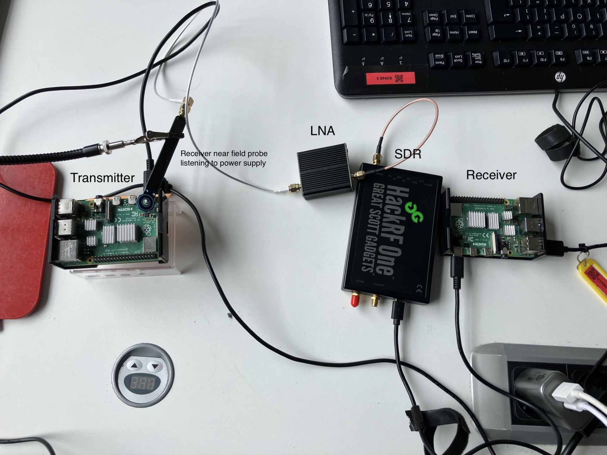

# Adaptive Covert Electromagnetic Transmission (MVP)

This project implements a minimal viable prototype (MVP) for a covert channel that leverages CPU load modulation on a Raspberry Pi 4 to generate electromagnetic (EM) emissions. Inspired by the ODINI channel, the system demonstrates air-gap communication by transmitting a single bit using On-Off Keying (OOK) modulation. The design also includes a receiver component that uses GQRX via TCP/IP (accessed with Telnet) to monitor changes in the EM signal level.

---

## Table of Contents

- [Components](#components)
  - [Transmitter (C Program)](#transmitter-c-program)
  - [Receiver (Python Script with GQRX)](#receiver-python-script-with-gqrx)
- [Prerequisites](#prerequisites)
  - [For the Transmitter](#for-the-transmitter)
  - [For the Receiver](#for-the-receiver)
- [Setup and Usage](#setup-and-usage)
  - [Transmitter Compilation and Execution](#transmitter-compilation-and-execution)
  - [Receiver Configuration and Execution](#receiver-configuration-and-execution)
- [Project Overview](#project-overview)
- [Future Work](#future-work)
- [Contributing](#contributing)
- [References](#references) <!-- Added placeholder -->

---



## Components

### Transmitter (C Program)

-   **Purpose:** Generate EM emissions by modulating CPU load.
-   **Platform:** Raspberry Pi 4 (Linux)
-   **Modulation:** On-Off Keying (OOK)
    -   **'1' Bit:** High CPU load achieved by spawning multiple computationally intensive threads.
    -   **'0' Bit:** Idle state implemented using a timed sleep.
-   **Implementation Details:**
    -   Continuously transmits the hardcoded bitstream: `"10101"`.
    -   **Timing:**
        -   `DURATION_ONE`: 1,000,000 μs (1 second) for high CPU load ('1').
        -   `DURATION_ZERO`: 1,000,000 μs (1 second) for idle state ('0').
        -   `REPEAT_PAUSE`: 1,000,000 μs (1 second) pause between full bitstream transmissions.
    -   **Multithreading:** Uses `NUM_THREADS = 8` threads to maximize CPU stress during '1' bit transmission.
    -   **Source File:** `cpu_transmitter.c` (Assumed filename)

### Receiver (Python Script with GQRX)

-   **Purpose:** Capture and analyze EM signal changes generated by the transmitter.
-   **Platform:** Raspberry Pi 4 or Raspberry Pi Zero (Linux)
-   **Method:**
    -   Connects to a running GQRX instance via its TCP/IP remote control interface (using Telnet protocol).
    -   Sends the `l` command periodically to query the current signal level (dB).
    -   Compares received signal levels to distinguish between the transmitter's idle ('0') and active ('1') states.
-   **Example Output Levels:**
    -   **Idle State:** Approximately -56.7 dB.
    -   **Active State (High CPU Load):** Approximately -44.9 dB to -48.5 dB.
-   **Source File:** `gqrx_tcp_ip_listener.py` (Assumed filename)

---

## Prerequisites

### For the Transmitter

-   **Hardware:** Raspberry Pi 4
-   **Operating System:** Linux (Raspberry Pi OS or similar)
-   **Compiler:** GCC (GNU Compiler Collection). Tested with `-O2` optimization.
-   **Libraries:** Pthreads (typically included by default in standard Linux C libraries).

### For the Receiver

-   **Hardware:** Raspberry Pi 4 or Raspberry Pi Zero
-   **Operating System:** Linux (Raspberry Pi OS or similar)
-   **Software:**
    -   GQRX SDR Receiver: Installed and configured. The TCP/IP remote control server must be enabled (usually listens on port `7356`).
    -   Python 3 interpreter.
-   **Python Libraries:**
    -   `telnetlib` (part of the standard Python library).

---

## Setup and Usage

### Transmitter Compilation and Execution

1.  **Navigate** to the directory containing the transmitter source code.
2.  **Compile** the C code using GCC:
    ```bash
    gcc -O2 -pthread cpu_transmitter.c -o cpu_transmitter
    ```
3.  **Run** the compiled transmitter executable:
    ```bash
    ./cpu_transmitter
    ```
    The program will start transmitting the `"10101"` bitstream repeatedly. Console output will indicate the current time and the bit ('0' or '1') being transmitted.

### Receiver Configuration and Execution

1.  **Start GQRX:** Launch GQRX on the receiver machine.
2.  **Enable TCP Remote Control:** In GQRX settings, ensure the TCP remote control server is enabled and note the port (default is `7356`). Tune GQRX to the frequency where the CPU emissions are most prominent (this requires experimentation).
3.  **Navigate** to the directory containing the receiver Python script.
4.  **Run** the Python listener script:
    ```bash
    python gqrx_tcp_ip_listener.py
    ```
    *(Ensure the script is configured with the correct GQRX host and port if not using defaults or running on a different machine).*

    The script will attempt to connect to GQRX via Telnet, periodically send the `l` command to fetch the signal level, and print the measurements. Observe the dB level changes corresponding to the transmitter's '0' (idle) and '1' (active) states.

---

## Project Overview

This MVP demonstrates the feasibility of establishing a covert communication channel across an air gap using modulated electromagnetic emissions generated by controlled CPU load variations on a Raspberry Pi 4. The transmitter employs a simple On-Off Keying (OOK) scheme, while the receiver leverages Software Defined Radio (SDR) principles via GQRX to detect these subtle signal changes. This prototype serves as a foundational exploration into EM side-channel attacks and communication, paving the way for more sophisticated implementations.

---

## Future Work

Potential areas for development and research include:

-   **Transmitter Enhancements:**
    -   Implement more complex modulation schemes (e.g., FSK, PSK based on frequency variations).
    -   Develop adaptive transmission parameters based on environmental noise or detection probability.
    -   Explore techniques to improve the stealth of the emissions.
    -   Investigate different hardware platforms and their EM characteristics.
-   **Receiver Improvements:**
    -   Develop more robust algorithms for real-time signal processing and bit recovery.
    -   Implement automatic frequency detection and tracking.
    -   Integrate machine learning models for improved signal detection and classification.
    -   Explore anomaly detection techniques to identify unknown covert transmissions.
-   **Defensive Strategies:**
    -   Research and develop countermeasures to detect, locate, and mitigate such covert EM channels (e.g., dynamic EM shielding, noise injection, system monitoring).

---

## Contributing

Contributions, suggestions, and issue reports are welcome. Please feel free to fork the repository, create a branch, and submit a pull request. As this is a research prototype exploring covert channel potential, use it responsibly and ethically.

---
